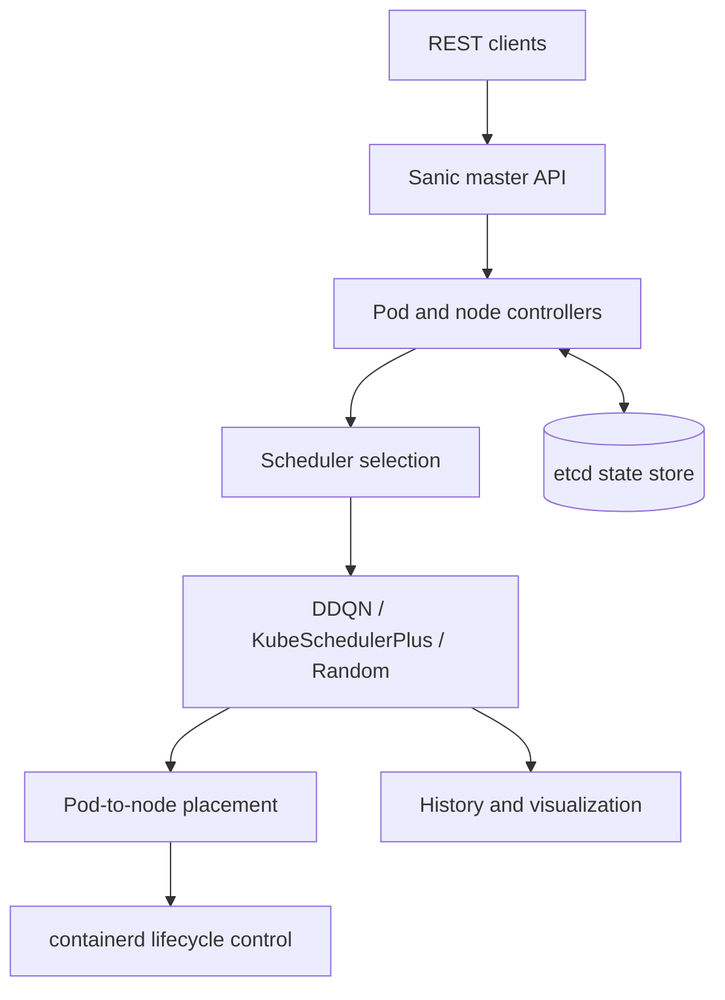

# gmnkube: Multi-Agent Container Scheduling Optimization Engine

A research-oriented Python container scheduling engine that combines DDQN-based adaptive decision-making with multi-resource scheduling, containerd lifecycle control, etcd-backed state management, and Sanic REST services.

| Project Information | Details |
| --- | --- |
| Project type | Team systems and machine-learning project |
| Project period | September 2023 - December 2024 |
| Team lead and original repository maintainer | [Puxi Yang](https://github.com/gmn-cristof) |
| Core developer and fork maintainer | [Yibo Feng](https://github.com/nhtsymh) |
| Advisor | Ruijin Wang |
| Institution | University of Electronic Science and Technology of China (UESTC) |

> **Repository provenance.** gmnkube was developed collaboratively. The team used the [original repository](https://github.com/gmn-cristof/gmnkube), maintained and published by project lead Puxi Yang, as its shared integration source. This fork is maintained by Yibo Feng to preserve the team implementation and supporting documentation for technical review.

---

## Overview

Container schedulers must assign heterogeneous workloads to nodes whose available CPU, memory, GPU, I/O, and network resources change over time. Fixed scheduling policies are efficient and interpretable, but they can require manual tuning when workload distributions or resource bottlenecks change.

gmnkube explores a feedback-driven alternative. It models cluster nodes as resource-bearing agents, represents Pod placement as a sequential decision problem, and uses scheduling outcomes to refine future decisions. The engine combines:

- a DDQN-based adaptive scheduler;
- resource-aware and random baseline schedulers;
- container, Pod, and node lifecycle controllers;
- containerd command-line integration;
- etcd-backed cluster-state persistence;
- master and node REST services;
- scheduling-history recording and visualization.

The modular structure separates learning-based scheduling from resource management and orchestration, making it possible to compare policies under a common control plane.

---

## Key Capabilities

- **Adaptive scheduling:** learns node-selection decisions with separate online and target Q-networks, experience replay, and periodic target synchronization.
- **Multi-resource awareness:** models CPU, memory, GPU, I/O, and network capacity across heterogeneous nodes.
- **Multiple scheduling strategies:** provides random, Kubernetes-style resource-aware, weighted multi-resource, and DDQN schedulers.
- **Pod and node orchestration:** manages Pod lifecycle, node registration, placement, status, and resource accounting.
- **Container lifecycle control:** creates, starts, stops, inspects, and removes containers through containerd's `ctr` interface.
- **Distributed state management:** persists container, Pod, node, and scheduling state through etcd.
- **REST control plane:** exposes cluster-management and scheduling operations through Sanic and Hypercorn.
- **Kubernetes-oriented data model:** accepts Kubernetes-style Pod specifications and provides a clear extension boundary for cluster integration.
- **Scheduling observability:** records Pod-to-node decisions, timestamps, and rewards, and exports scheduling-history visualizations.
- **Evaluation tooling:** includes unit tests, API tests, scheduler tests, and a configurable multi-node workload driver.

---

## System Architecture



The control plane receives node, Pod, container, and scheduling requests through the master API. Controllers maintain cluster objects and resource state, while the selected scheduling policy maps each pending Pod to a target node. State transitions are persisted in etcd, and container operations are delegated to containerd.

---

## Scheduling Strategies

| Scheduler | Decision mechanism | Purpose |
| --- | --- | --- |
| `Scheduler` | Random node selection | Baseline for policy comparison |
| `Kube_Scheduler` | Feasibility filtering followed by resource-usage prioritization | Kubernetes-style resource-aware scheduling |
| `Kube_Scheduler_Plus` | Weighted scoring over CPU, memory, GPU, I/O, and network state | Multi-resource load-aware scheduling |
| `DDQNScheduler` | Q-network-based node selection with replay memory and target-network updates | Adaptive scheduling from interaction history |

All strategies operate on the same node and Pod abstractions, allowing scheduling behavior to be compared without changing the resource-management layer.

---

## DDQN Scheduling Model

### State

For each node, the scheduler constructs a nine-dimensional feature vector:

```text
[allocated CPU, allocated memory, allocated GPU,
 free CPU,      free memory,      free GPU,
 requested CPU, requested memory, requested GPU]
```

The per-node features are concatenated into a cluster-level state representation for the current Pod.

### Action

Each action corresponds to selecting one registered node:

```text
action = index of the target node
```

The output dimension is updated when the number of registered nodes changes.

### Reward

The reward combines three signals:

1. **Placement feasibility:** infeasible or unavailable nodes receive a negative reward.
2. **Resource utilization:** node-level CPU, memory, and GPU utilization influences placement preference.
3. **Load balance:** the standard deviation of resource utilization across nodes is converted into a balance factor.

The implemented reward has the following structure:

```text
reward =
    1 - mean(selected-node utilization)
    + 0.5 * mean(cluster load-balance factors)
```

This formulation links each scheduling decision to both local capacity and cluster-wide balance.

### Learning

The scheduler maintains an online Q-network and a target Q-network. Scheduling transitions are stored in a replay buffer, sampled in mini-batches, and optimized with mean-squared temporal-difference loss. The target network is synchronized periodically to stabilize learning.

An epsilon-controlled handoff combines resource-based node selection with learned Q-values, allowing the system to retain feasible placement behavior while accumulating interaction experience.

---

## Scheduling Workflow

1. A node registers its identity and available resources through the REST API.
2. A Kubernetes-style Pod specification is parsed into container and resource requests.
3. The selected scheduler collects node utilization and current Pod requirements.
4. Infeasible or unavailable nodes are excluded from valid placement.
5. The scheduler selects a target node and updates resource allocation.
6. The transition, reward, target node, and timestamp are recorded for learning and analysis.
7. Updated cluster state is persisted through etcd.

---

## System Modules

| Module | Responsibility |
| --- | --- |
| `orchestrator/` | DDQN, random, and resource-aware scheduling policies; workload control |
| `node/` | Node registration, health state, capacity tracking, and Pod placement |
| `pod/` | Pod parsing, lifecycle management, and container composition |
| `container/` | Container objects, containerd runtime commands, and image management |
| `etcd/` | Cluster-state persistence, prefix queries, watches, leases, and configuration |
| `api/` | Master and node REST services and resource-management routes |
| `config/` | Scheduler, etcd, node, and Kubernetes-style Pod configurations |
| `tests/` | Unit, API, environment, scheduler, and system-level test drivers |
| `docs/` | Architecture description, usage notes, and design records |

---

## Evaluation Summary

The team technical report evaluates the engine in single-node, cross-node, and comparative scheduling scenarios.

| Evaluation Item | Configuration |
| --- | --- |
| Cluster size | 10 heterogeneous nodes |
| Workload size | 25 Pods |
| Pod composition | 1-3 containers per Pod |
| Resource requests | Randomized CPU, memory, and GPU demands |
| Compared behavior | Adaptive and resource-aware scheduling against a conventional comparison scheduler |
| Recorded signals | Placement decisions, scheduling rewards, resource utilization, and load balance |

Under the controlled 10-node, 25-Pod configuration documented in the report, the proposed engine achieved:

- **18% higher average resource utilization**;
- **25% lower inter-node load disparity**;
- consistently higher load-balancing reward in the reported DDQN comparison.

The repository includes workload-generation and schedule-history utilities corresponding to this evaluation workflow.

---

## Technology Stack

| Area | Technology |
| --- | --- |
| Language | Python 3.11 |
| Learning framework | TensorFlow / Keras, NumPy |
| API layer | Sanic, Hypercorn, sanic-cors |
| State store | etcd |
| Container runtime | containerd and `ctr` |
| Orchestration model | Kubernetes-style Pod and node resources |
| Resource telemetry | psutil, GPUtil |
| Configuration | YAML, JSON |
| Visualization | Matplotlib |
| Testing | unittest, pytest, sanic-testing |

---

## Getting Started

### 1. Reference Environment

The project was developed with:

- Ubuntu 23.04 under WSL;
- Python 3.11;
- containerd;
- etcd;
- Visual Studio Code Remote Development.

For cluster-connected execution, provide access to the relevant containerd, etcd, and Kubernetes services.

### 2. Clone the Repository

```bash
git clone https://github.com/nhtsymh/gmnkube.git
cd gmnkube
```

### 3. Create a Python Environment

```bash
python3.11 -m venv .venv
source .venv/bin/activate
python -m pip install --upgrade pip
```

Install the runtime packages used by the scheduling, API, persistence, and telemetry modules:

```bash
pip install sanic sanic-cors sanic-testing hypercorn \
  pyyaml requests numpy tensorflow matplotlib \
  etcd3 protobuf==3.20.1 psutil GPUtil pytest
```

### 4. Configure the Environment

```bash
export PYTHONPATH="$(pwd):${PYTHONPATH}"
export TF_ENABLE_ONEDNN_OPTS=0
```

Review the following files before starting the services:

- `config/config.yaml`: API, scheduler, and etcd settings;
- `config/etcd_config.yaml`: etcd endpoints and lease configuration;
- `config/pod_example.yaml`: example Kubernetes-style Pod specification;
- `config/pod_example.json`: example JSON Pod specification.

### 5. Start the Control Plane

Ensure etcd is reachable and containerd is running, then start the master service:

```bash
python api/api_server_master.py
```

The REST API listens on:

```text
http://localhost:8001
```

---

## REST API

### Core Endpoints

| Method | Endpoint | Purpose |
| --- | --- | --- |
| `POST` | `/nodes` | Register a node and its resource capacity |
| `GET` | `/nodes` | List registered nodes |
| `GET` | `/nodes/<name>` | Inspect a node |
| `DELETE` | `/nodes/<name>` | Remove a node |
| `POST` | `/pods` | Create a Pod from a Kubernetes-style specification |
| `GET` | `/pods` | List Pods |
| `DELETE` | `/pods/<name>` | Remove a Pod |
| `POST` | `/DDQN_schedule` | Schedule a Pod with DDQN |
| `POST` | `/kube_schedule` | Schedule a Pod with the resource-aware policy |
| `GET` | `/DDQN_schedule_history` | Inspect DDQN scheduling history |
| `GET` | `/kube_schedule_history` | Inspect resource-aware scheduling history |
| `POST` | `/save_DDQN_schedule` | Export DDQN scheduling history |
| `POST` | `/save_kube_schedule` | Export resource-aware scheduling history |

### Example: Register a Node

```bash
curl -X POST http://localhost:8001/nodes \
  -H "Content-Type: application/json" \
  -d '{
    "name": "node-1",
    "ip_address": "192.168.1.101",
    "total_cpu": 8,
    "total_memory": 17179869184,
    "total_gpu": 1,
    "total_io": 5000,
    "total_net": 10000
  }'
```

### Example: Create a Pod

```bash
curl -X POST http://localhost:8001/pods \
  -H "Content-Type: application/json" \
  -d @config/pod_example.json
```

### Example: Schedule with DDQN

```bash
curl -X POST http://localhost:8001/DDQN_schedule \
  -H "Content-Type: application/json" \
  -d '{
    "apiVersion": "v1",
    "kind": "Pod",
    "metadata": {
      "name": "example-pod",
      "namespace": "default",
      "status": "pending"
    }
  }'
```

### Example: Inspect Scheduling History

```bash
curl http://localhost:8001/DDQN_schedule_history
```

---

## Evaluation Driver

With the API running, the system-level workload driver can be invoked from Python:

```bash
python - <<'PY'
from tests.system_tester import SystemTester

SystemTester(
    base_url="http://localhost:8001",
    node_count=10,
    pod_count=25,
    schedule_method="DDQN_schedule",
).run_test()
PY
```

To evaluate the resource-aware scheduler, set `schedule_method="kube_schedule"`.

Generated scheduling histories can be written under `output/` through the corresponding REST endpoints.

---

## Repository Structure

```text
gmnkube/
├── api/
│   ├── api_server_master.py
│   ├── api_server_node.py
│   └── routes.py
├── config/
│   ├── config.yaml
│   ├── etcd_config.yaml
│   ├── pod_example.json
│   └── pod_example.yaml
├── container/
│   ├── container.py
│   ├── container_manager.py
│   ├── container_runtime.py
│   └── image_handler.py
├── etcd/
│   ├── etcd_client.py
│   ├── etcd_config.py
│   └── etcd_manager.py
├── node/
│   ├── node.py
│   └── node_controller.py
├── orchestrator/
│   ├── DDQN_scheduler.py
│   ├── kube_scheduler.py
│   ├── kube_scheduler_plus.py
│   ├── scheduler_random.py
│   └── workload_controller.py
├── pod/
│   ├── pod.py
│   └── pod_controller.py
├── tests/
│   ├── system_tester.py
│   ├── test_DDQN_scheduler.py
│   ├── test_env.py
│   ├── test_kube_scheduler_plus.py
│   └── ...
├── docs/
│   ├── Overall_architecture_model.md
│   ├── architecture.md
│   └── usage.md
├── model_structure.png
├── requirements.txt
├── setup.py
└── README.md
```

---

## Documentation

- [Overall Architecture Model](docs/Overall_architecture_model.md)
- [Architecture and Module Design](docs/architecture.md)
- [Usage Notes](docs/usage.md)
- [DDQN Model Structure](model_structure.png)
- [Original Team Repository](https://github.com/gmn-cristof/gmnkube)

---

## License

This project is released under the [MIT License](LICENSE).

---

## Acknowledgment

Developed as a team project at UESTC under the supervision of **Ruijin Wang**. The original team repository was maintained and published by project lead **Puxi Yang**; this fork is maintained by core developer **Yibo Feng**.
